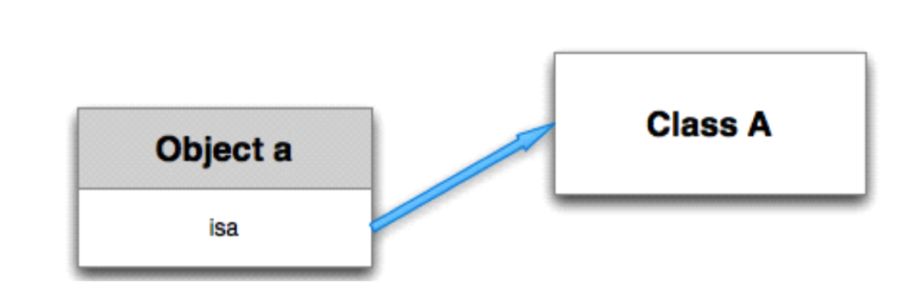

##IOS 面试题
##1.isa指针
- 每一个对象都包含一个isa指针.这个指针指向当前对象所属的类。
- [p eat];表示给p所指向的对象发送一条eat消息,调用对象的eat方法,此时对象会顺着内部的isa指针找到存 储于类中的方法,执行。
- isa是对象中的隐藏指针,指向创建这个对象的类。
- 通过isa指针我们可以在运行的时候知道当前对象是属于那个Class（类）的

2.\#import和\#include区别
- \#import与\#include的类似，都是把其后面的文件拷贝到该指令所在的地方
- \#import可以自动防止重复导入
- \#import <> 用于包含系统文件
- \#import""用于包含本项目中的文件

- \#import和@class作用上的区别
    + \#import会包含引用类的所有信息(内容),包括引用类的变量和方法
    + @class仅仅是告诉编译器有这么一个类, 具体这个类里有什么信息, 完全不知

